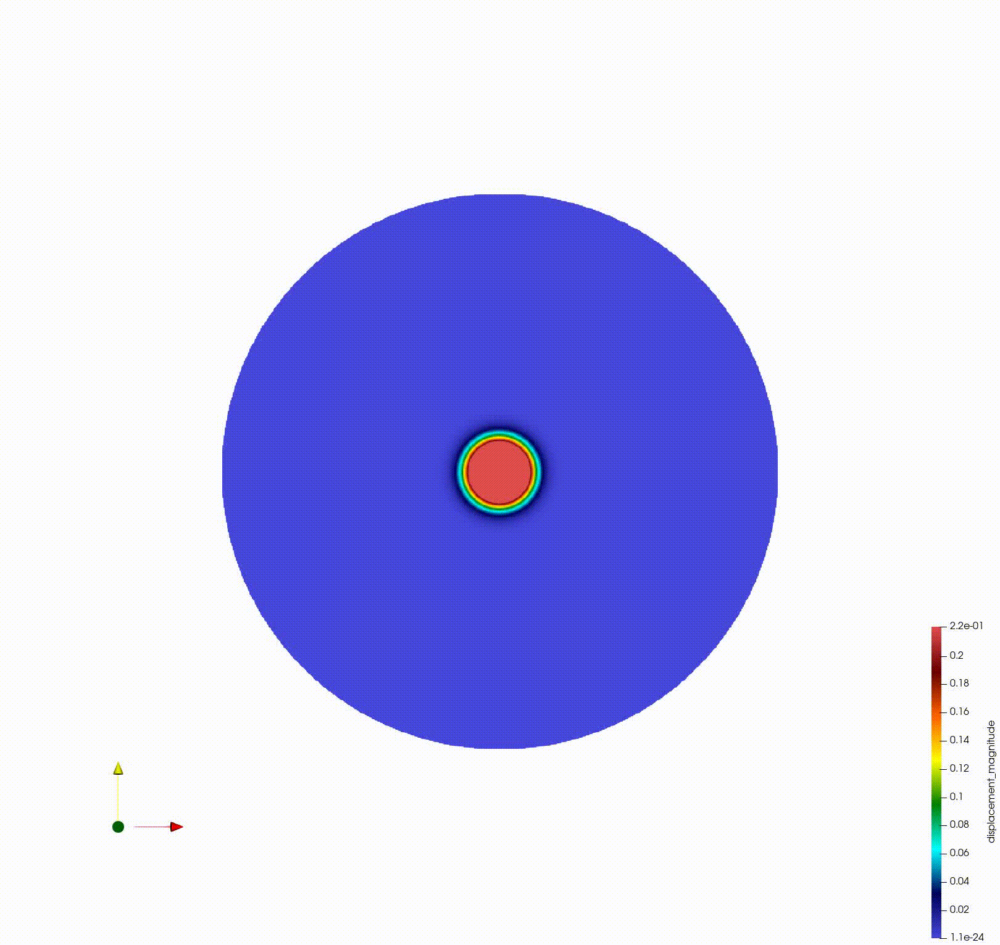
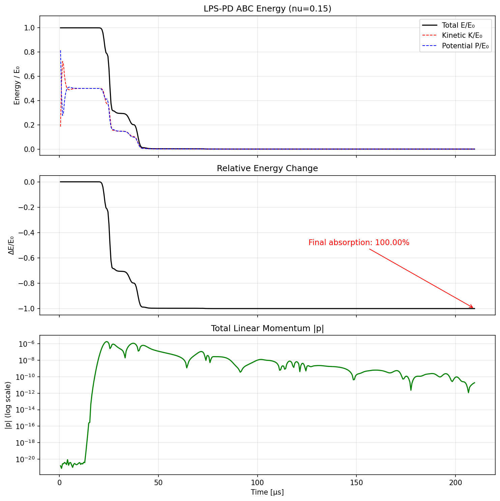
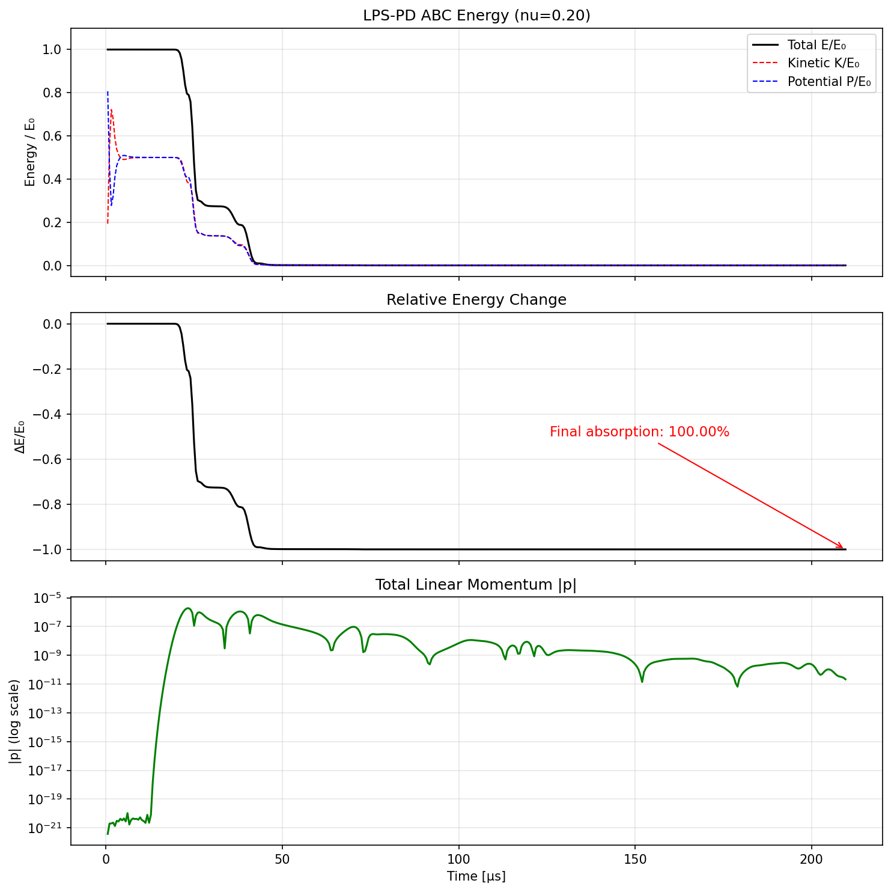
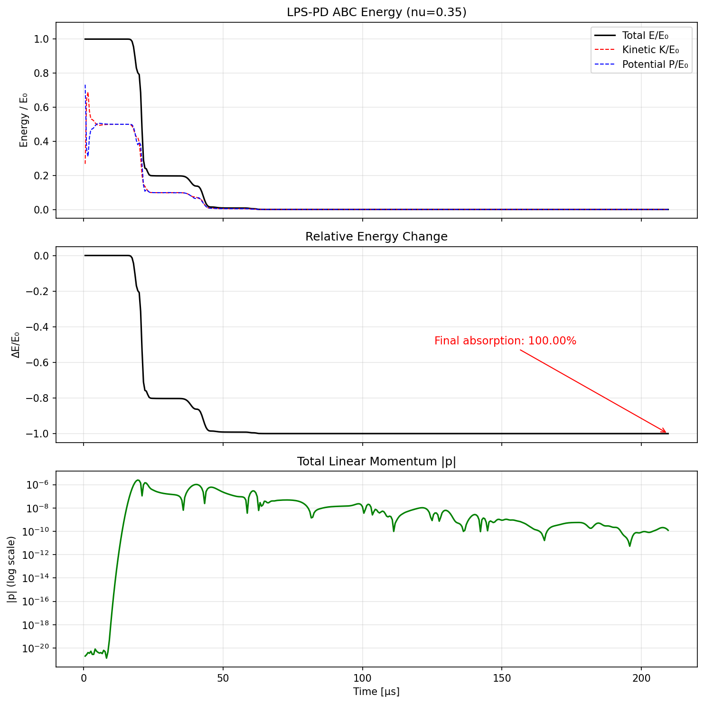
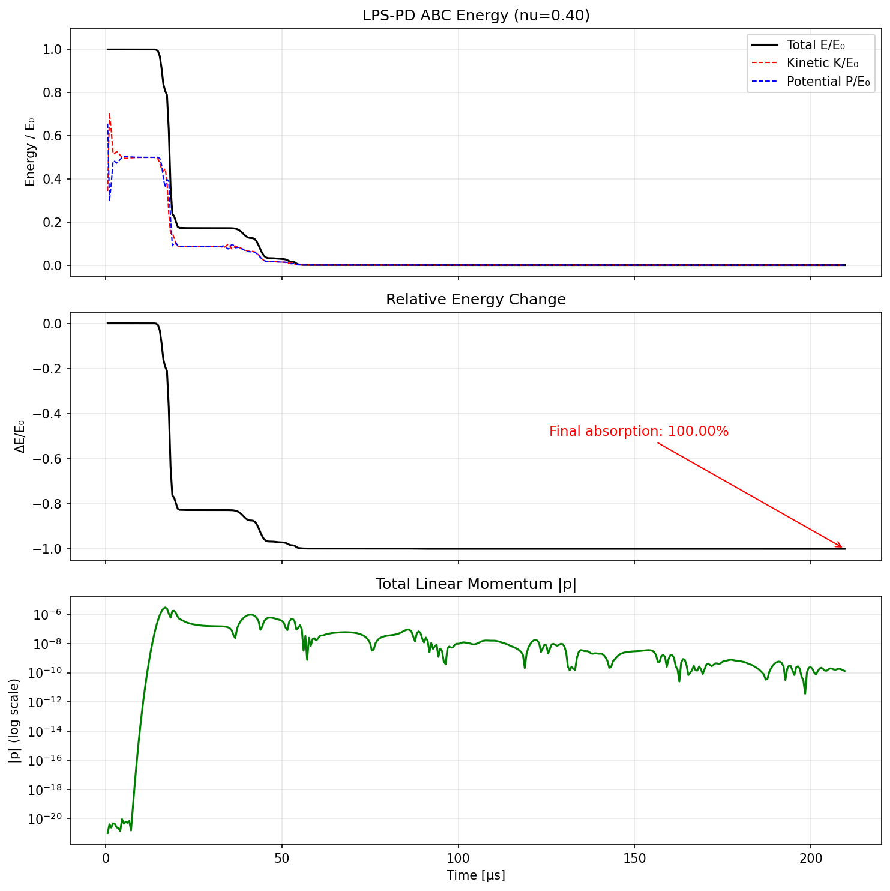
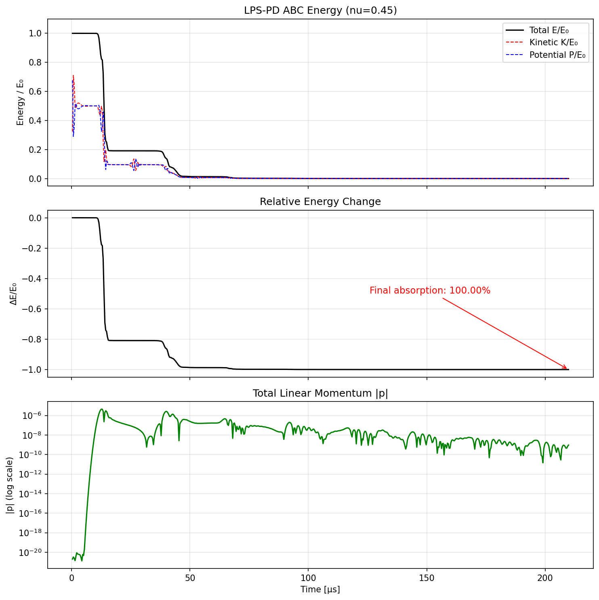
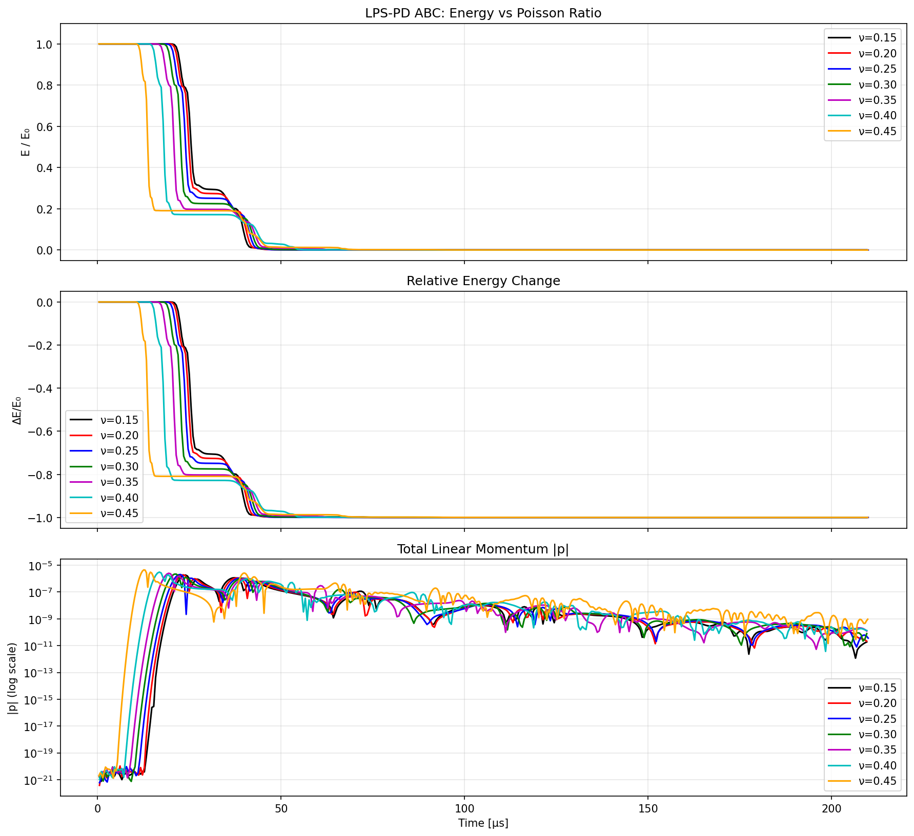

# PD-LPS-ABC: Absorbing Boundary Conditions for Linear Peridynamic Solid

[](https://github.com/alhermann/peridynamic-lps-absorbing-boundary)

Nonlocal Dirichlet-type absorbing boundary conditions (ABCs) for 2D elastic wave propagation in ordinary state-based (LPS) peridynamics.

## Overview

This code implements absorbing boundary conditions for the **Linear Peridynamic Solid (LPS)** model, extending the bond-based (BB-PD) formulation to general Poisson ratios. The ABCs are constructed from discrete PD plane wave modes (P-waves and S-waves) using the peridynamic dispersion relation, ensuring consistency with the near-field discretization.

### Simulation: Gaussian pulse with ABC (nu = 0.25)



## Method

The approach follows a two-stage workflow:

1. **Preprocessor** (`preprocessor/main.cpp`): Constructs the ABC operators
   - Generates a circular PD domain with an absorbing boundary layer
   - Solves the discrete LPS dispersion relation for plane wave modes
   - Builds least-squares fitting operators (G_u, G_v) for each ABC node
   - Performs a 2D stability sweep over (dt, delta_kappa) to select optimal parameters
   - Exports all data files for the solver

2. **Solver** (`src/main.cpp`): Time-domain simulation with velocity Verlet
   - Reads preprocessor data and runs explicit time marching
   - Applies ABC displacement and velocity updates at each step
   - Includes dilatation extrapolation at ABC nodes for LPS consistency

### Key features

- State-based LPS formulation with dilatation coupling (arbitrary Poisson ratio)
- Discrete dispersion relations (not continuum) for nonlocal consistency
- Automatic parameter selection via spectral stability analysis
- Dilatation extrapolation at ABC nodes (inverse-distance weighted from interior neighbors)

## Building

```bash
mkdir build && cd build
cmake .. -DCMAKE_BUILD_TYPE=Release
make
```

Requires:
- C++11 or later
- CMake 3.10+
- LAPACK (Apple Accelerate on macOS, or system LAPACK on Linux)
- OpenMP (optional, for parallelization)

## Usage

### Step 1: Preprocessing

```bash
cd build
./lps_abc_preprocessor <jobname> [nu]
```

Example:
```bash
./lps_abc_preprocessor example1_nu025 0.25
```

This generates data files `example1_nu025.*` with domain, horizons, ABC operators, and initial conditions.

### Step 2: Solving

```bash
./PD2_LPS_ABC <output_prefix> <jobname>
```

Example:
```bash
./PD2_LPS_ABC _out example1_nu025
```

Output files: `example1_nu025_out.energy` (energy/momentum time series), `example1_nu025_out.verify` (verification data), VTK snapshots.

### Step 3: Visualization

```bash
python3 plot_energy.py results_nu_sweep/solver_nu025.txt "nu=0.25" energy_plot_nu025
```

## Results: Poisson Ratio Sweep

The ABC achieves near-perfect absorption across a wide range of Poisson ratios (nu = 0.15 to 0.45):

| nu   | lambda_PD  | Final dE/E0 | Absorption |
|------|------------|-------------|------------|
| 0.15 | -0.00364   | -1.000      | 100.00%    |
| 0.20 | -0.00203   | -1.000      | 100.00%    |
| 0.25 |  0.00000   | -1.000      | 100.00%    |
| 0.30 | +0.00138   | -1.000      | 100.00%    |
| 0.35 | +0.00275   | -1.000      | 100.00%    |
| 0.40 | +0.00414   | -1.000      | 100.00%    |
| 0.45 | +0.00554   | -1.000      | 100.00%    |

### Energy plots

#### nu = 0.15


#### nu = 0.20


#### nu = 0.25 (bond-based limit)


#### nu = 0.30


#### nu = 0.35


#### nu = 0.40


#### nu = 0.45


### Comparison across Poisson ratios


## Project Structure

```
PD2_LPS_ABC/
├── CMakeLists.txt          # Build configuration
├── src/
│   └── main.cpp            # LPS-PD solver with ABCs
├── preprocessor/
│   └── main.cpp            # ABC operator construction
├── src/helpers/
│   ├── utils.h             # Matrix/vector utilities
│   ├── space.h             # Spatial data structures
│   └── kd_tree_interface.h # k-d tree for neighbor search
├── libraries/
│   └── libkdtree++/        # k-d tree library
├── tests/
│   └── generate_test_data.cpp
├── docs/                   # Energy plots
├── nu025.gif               # Animation
└── README.md
```

## Material Parameters (Example 1)

- Material: Steel 18Ni1900
- Young's modulus: E = 190 GPa (0.19 N/mm^2 in simulation units)
- Density: rho = 8000 kg/m^3 (8e-15 N*s^2/mm^4)
- Horizon: delta = 2 mm, grid spacing: dx = 0.5 mm
- Domain: circular, R = 125 mm
- Initial condition: Gaussian displacement pulse (radius 40 mm)

## License

MIT License. See [LICENSE](LICENSE).